# MemMole 项目架构文档

## 项目概述

MemMole 是一个用Go语言实现的自定义虚拟机语言，采用经典的编译器架构设计，支持变量声明、函数定义、控制流、网络操作等功能。

## 整体架构流程

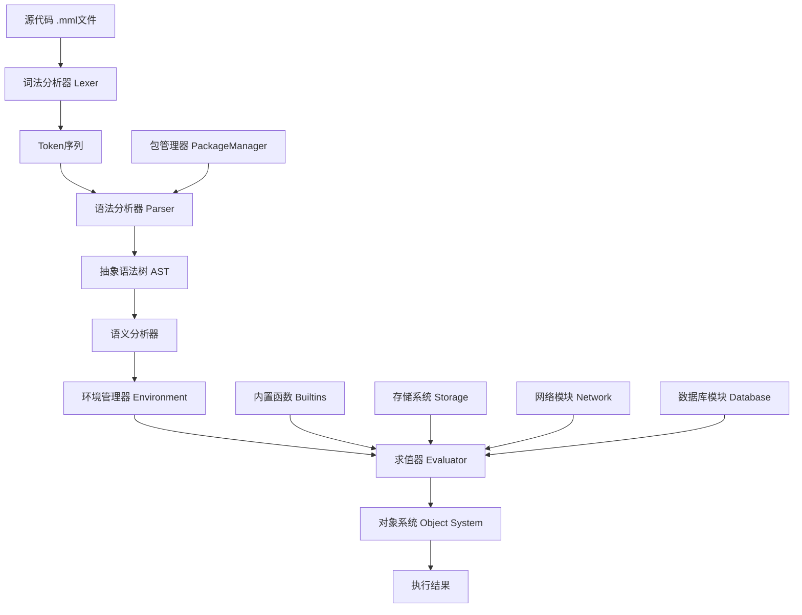

## 核心组件详解

### 1. 词法分析器 (Lexer)

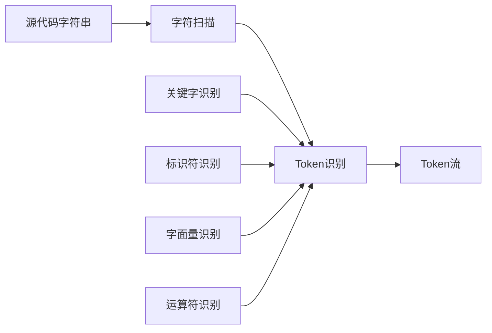

**功能**:
- 将源代码转换为Token序列
- 支持关键字: `fn`, `if`, `else`, `while`, `return`, `package`, `import`
- 支持字面量: 整数、字符串、布尔值
- 支持运算符: `+`, `-`, `*`, `/`, `==`, `!=`, `>`, `<`
- 错误位置跟踪

### 2. 语法分析器 (Parser)

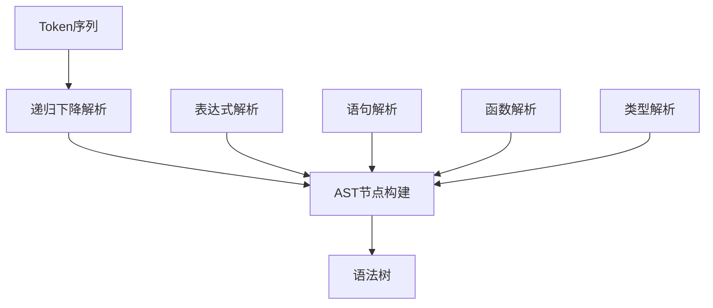

**解析策略**:
- 递归下降解析 (Recursive Descent Parsing)
- 运算符优先级解析 (Operator Precedence Parsing)
- 前缀和中缀解析函数映射

**优先级层次**:
```
LOWEST < ASSIGNMENT < COMPARE < SUM < PRODUCT < PREFIX < CALL < MEMBER
```

### 3. 抽象语法树 (AST)

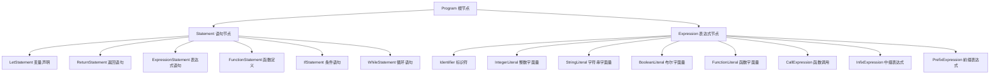

### 4. 求值器 (Evaluator)

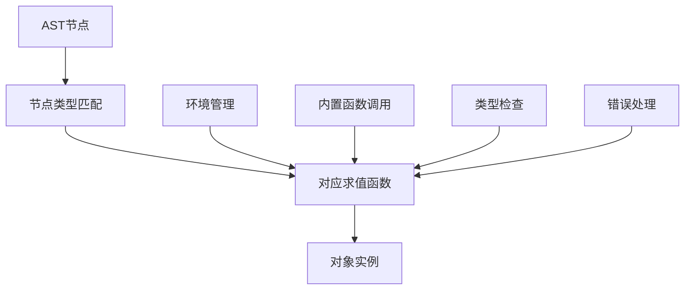

**求值策略**:
- 树遍历求值 (Tree Walking Evaluation)
- 环境链作用域管理
- 函数闭包支持

### 5. 对象系统 (Object System)

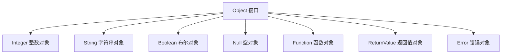

## 数据流程图

### 完整执行流程

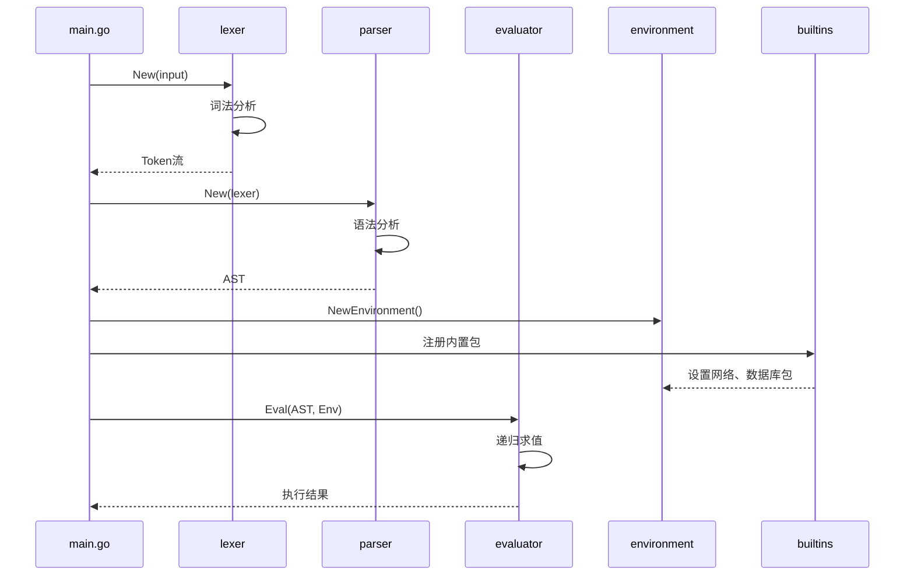

### 解析树构建过程

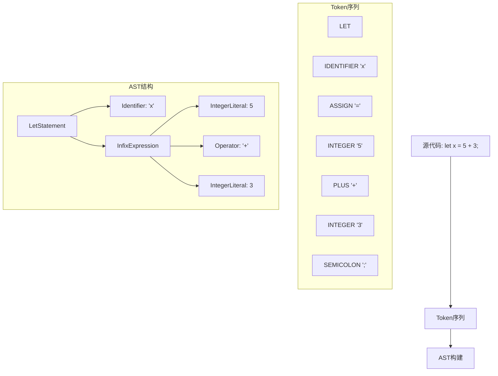

## 模块依赖关系

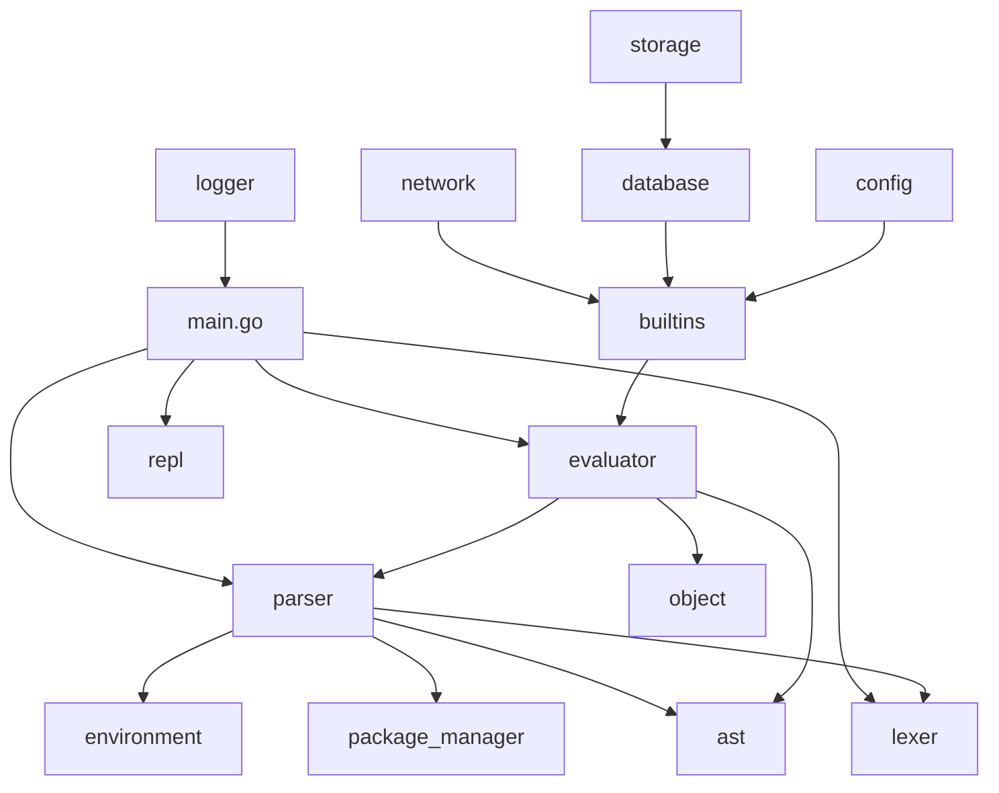

## 包管理架构

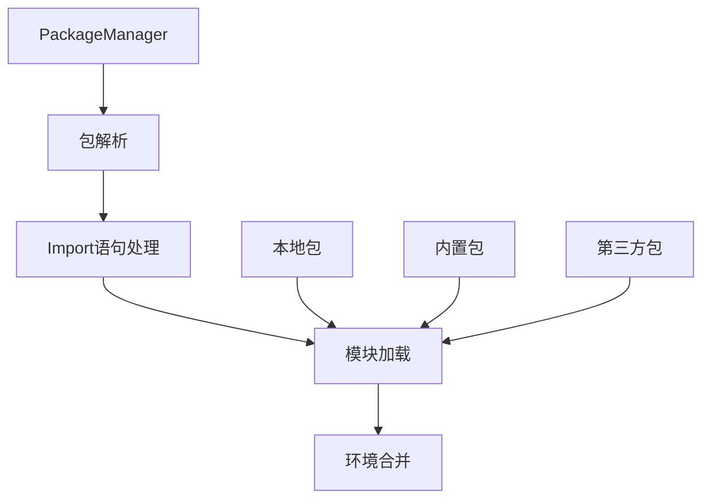

## 错误处理流程

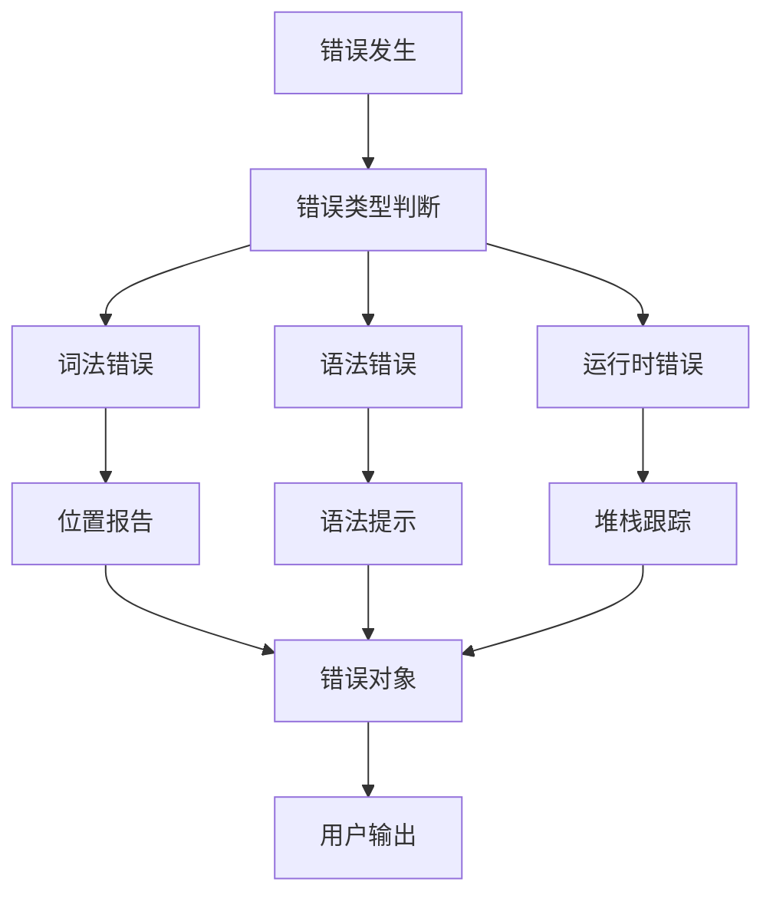

## 性能优化点

1. **词法分析优化**
   - 字符预读减少重复扫描
   - Token缓存机制

2. **语法分析优化**
   - 运算符优先级表快速查找
   - 解析函数映射表

3. **求值优化**
   - 环境链缓存
   - 内置函数快速分发

## 扩展性设计

1. **新语法特性添加**
   - Lexer: 添加新Token类型
   - Parser: 添加解析函数
   - AST: 添加新节点类型
   - Evaluator: 添加求值逻辑

2. **新内置函数**
   - 在builtins包中实现
   - 注册到环境管理器

3. **新存储后端**
   - 实现Storage接口
   - 注册到数据库包

## 总结

MemMole 采用经典的三阶段编译器架构，具有良好的模块化设计和扩展性。通过清晰的分层架构，使得各个组件职责明确，便于维护和扩展。
