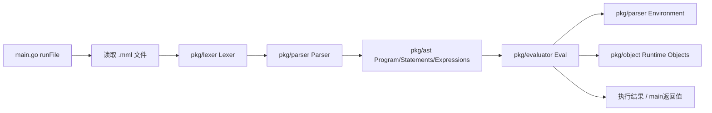
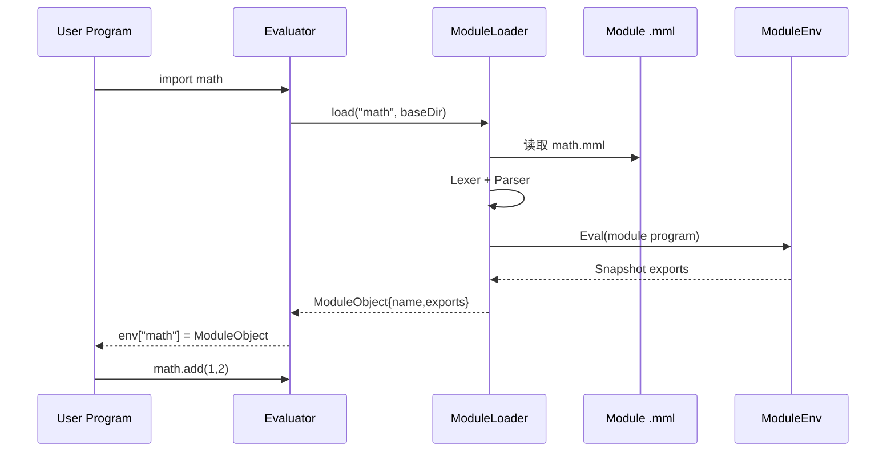
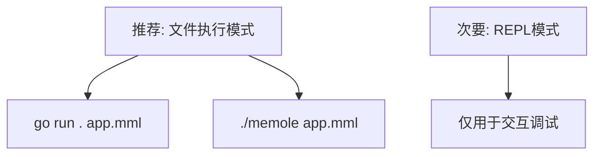

# Memole Interpreter Runtime

## 1) 解释器如何运作

Memole 当前是一个典型的解释器流水线，执行 `.mml` 文件时会经过：

1. 读取源码文件
2. 词法分析（Lexer）切分 Token
3. 语法分析（Parser）构建 AST
4. 求值执行（Evaluator）遍历 AST
5. 在运行时环境（Environment/Object）中读写变量、函数和结构体



## 2) 模块 import 的运行机制（当前实现）

`import` 已经是可执行的模块加载机制，不再是占位逻辑：

- 导入时读取目标模块 `.mml` 文件
- 模块会再次走 `Lexer -> Parser -> Eval`
- 模块导出符号进入 `ModuleObject.Exports`
- 调用方通过 `mod.member` 访问导出成员
- 模块加载有缓存（同一模块不会重复加载）
- 有循环导入检测（避免递归爆栈）



## 3) 入口行为

`main.go` 当前逻辑：

- `run <file.mml>`：执行文件模式（推荐）
- `<file.mml>`：执行文件模式（简写）
- `repl`：进入 REPL 模式（显式开启）
- 无参数：输出 usage，不再默认进入 REPL

也就是说，**推荐的正式运行方式是“执行文件”**，而不是临时拼脚本。

## 4) 运行方式（按 Go 风格执行文件）

你提到要和 `go` 一样的方式，这里给出推荐命令：

### 开发阶段（直接用 go run）

```bash
go run . run ./examples/hello.mml
```

### 产物阶段（先编译再执行）

```bash
go build -o memole .
./memole run ./examples/hello.mml
```

这两种都属于“给解释器一个 `.mml` 文件路径再执行”的模式，和 `go run main.go` / `go run .` 的思路一致。

## 5) 与 Python 脚本式临时执行的区别

- Memole 当前主路径是：**执行已有 `.mml` 文件**
- 不建议把它当成“随手写一段脚本立即跑”的 Python 风格入口
- REPL 主要用于调试语法片段，不是主交付运行方式



